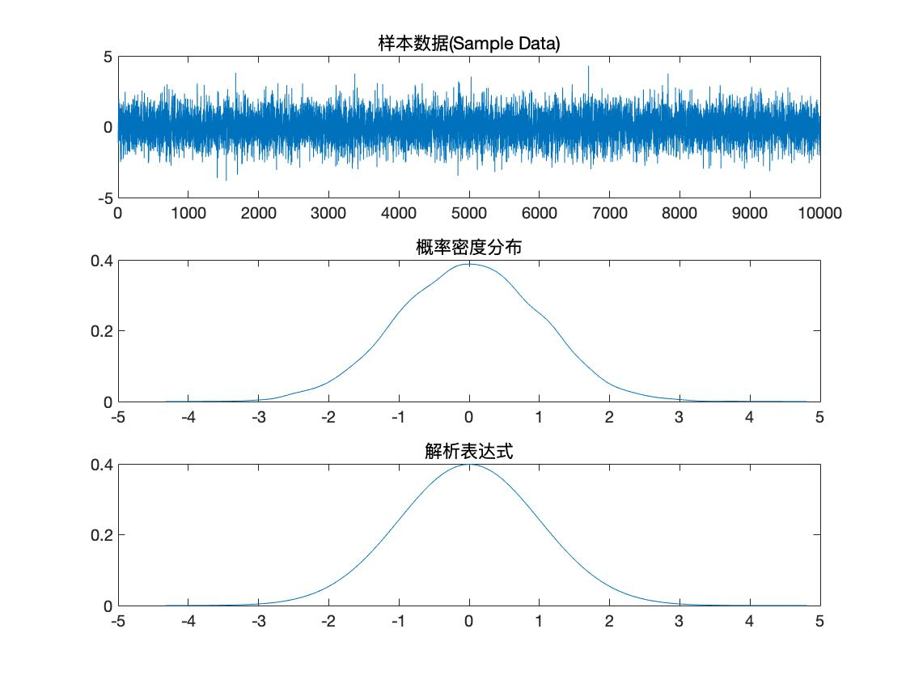
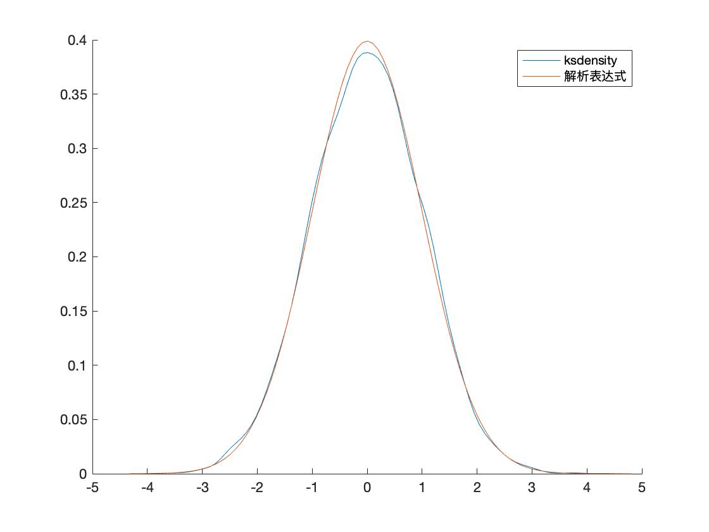

# 环境资源模型课程作业

- 项目地址

[TOC]

## 用二次多项式拟合表中所列的数据点：

| x    | 1    | 2    | 3    |
| ---- | ---- | ---- | ---- |
| y    | 2    | 5    | 10   |

### 运行代码

```matlab
clc,clear
%输入x,y
x = [1 2 3]
y = [2 5 10]
%利用x,y拟合多项式，2表示二次多项式
p2 = polyfit(x,y,2)
%绘制图形
x2 = 0:0.1:4  %采用0.1间距曲线更为平滑
y2 = polyval(p2,x2)
plot(x,y,'*',x2,y2,'-')
```

### 输出图形


## 计算二重积分

$$
\int_{0\leq{y}\leq{2}}\int_{-1\leq{x}\leq{1}}sinx\sqrt{y}dxdy
$$

### 运行代码

``` matlab
clc,clear
a = dblquad('sin(x)*sqrt(y)',-1,1,0,2)
%a = -4.4306e-18
```

## 用左除法和求逆法求解下列线性方程组


### 运行代码

``` matlab
clc,clear
% MATLAB左除法(\)求解线性方程组
% A是线性方程组等号左边系数构成的矩阵
A = [1 2 3;-1 3 7;9 0 3];
% b是线性方程组等号右边常数构成的矩阵
b = [1 4 7]';
x = A\b
%得到x值为x = 0.3333 -1.6667  1.3333

clc,clear
% MATLAB求逆法(inv)求解线性方程组
% A是线性方程组等号左边系数构成的矩阵
A = [1 2 3;-1 3 7;9 0 3];
% b是线性方程组等号右边常数构成的矩阵
b = [1 4 7]';
x = inv(A)*b
%得到x值为x = 0.3333 -1.6667  1.3333
```

## 计算微分方程的通解

$$
\frac{dy}{dx}+3xy=xe^{x^{2}}
$$

### 运行代码

```matlab
clc,clear
dsolve('Dy+3*x*y=x*e^(x^2)','x')
%ans = C1*exp(-(3*x^2)/2) + e^(x^2)/(2*(log(e) + 3/2))
```

## 计算向量

> **对于向量：**
>
> - **x**=[1,2,2,2,1,2];
>
> - **y**=[2,3,2,2,3,2];
>
> 1)分别计算向量x,y的均值，方差
>
> **2)****计算二者之间的协方差和相关系数。

### 运行代码

```matlab
clc,clear
%input x,y
x=[1,2,2,2,1,2];
y=[2,3,2,2,3,2];

%计算x的均值方差
fprintf('x的均值为%d\n',mean(x))
fprintf('x的方差为%d\n',var(x))

%计算y的均值方差
fprintf('y的均值为%d\n',mean(y))
fprintf('y的方差为%d\n',var(y))

%计算二者之间的协方差和相关系数
%上下拼合矩阵
A = [x;y]
%获得输入数据维度
[m,n] = size(A);
%创建协方差矩阵
COVMAT = zeros(m,m);
%取得每维数据平均值
E = zeros(m,1);
for i = 1:m
   E(i) = mean(A(i,:));
end
%计算协方差
for i = 1:m
   for j = 1:m
      COVMAT(i,j) = ((A(i,:)-E(i))*(A(j,:)-E(j))')./(n-1);
   end
end
%输出协方差矩阵
COVAMT
%COVMAT = 0.2667   -0.0667
%        -0.0667    0.2667
```

## 绘制饼图

- x = rand(1,5); y = [0.2 0.45 0.1];

- 根据x, y的值作出下图。


### 运行代码

```matlab
clc,clear
%输入x，y
x = rand(1,5); 
y = [0.2 0.45 0.1];

%绘制饼图
pie(x)
hold()
pie(y)
```

## 绘制Talyor函数

> 使用M脚本方式绘制$y=e^x$及其四阶泰勒级数$p_{4}(x)$在[-1,1]上的图像，同时在同一幅图中画出$error = e^x-p_{4}(x)$的图像 ，最后用function实现该功能，输入的参数为自变量x取值和泰勒展开阶次，并考察泰勒级数增大时候，error的变化情况
>
> 提示：使用命令plot同一副图中画多个图像使用hold ，相关命令taylor, polyval, sym2poly 

### 运行代码

```matlab
clc,clear

%声明变量
function[] = errortalyor(a,n)  
syms x y y1
y = exp(x);
y1 = taylor(y,x,n)
x=a
plot(a,eval(y1))
hold on
plot(a,eval(y)-eval(y1))


%测试用例
errortalyor(-1:0.1:1,4)

for i = 1:100
		errortalyor(-1:0.1:1,i)
		i
end
```

- 泰勒级数增大时，error逐渐变大

- 0到100级图片


- function文件： [errortalyor.m](errortalyor.m) 

## 求函数


### 运行代码

```matlab
%第一小题求解常数C，思路是定积分求解
y1 = c/sqrt(1-x^2)
int(y,-1,1)
fprintf('c值为1/pi‘)
%得到 pi*c，已知pi*c=1，所以c=1/pi

%第二小题新建函数y2
y2 = 1/(pi*sqrt(1-x^2))
int(y2,-0.5,0.5)
fprintf('概率为1/3‘)
%得到答案1/3

%求分布函数
int(y2)
fprintf('分布函数为f(x)=asin(x)/pi，|x|<1‘)
%得到结果asin(x)/pi
```

## 画图形


### 运行代码

```matlab
%题目一代码
syms x y1 y2 y2
y1 = exp(-x^2/2)/sqrt(2*pi);
y2 = exp(-(x+1)^2/2)/sqrt(2*pi);
y3 = exp(-(x-1)^2/2)/sqrt(2*pi);
hold
x = -10:0.1:10;
plot(x,eval(y1))
plot(x,eval(y2))
plot(x,eval(y3))
```

运行结果如下：


```matlab
%题目二代码
syms x y1 y2 y2
y1 = exp(-x^2/2)/sqrt(2*pi);
y2 = exp(-(x+1)^2/8)/(sqrt(2*pi)*2);
y3 = exp(-(x-1)^2/32)/(sqrt(2*pi)*4);
hold
x = -10:0.1:10;
plot(x,eval(y1))
plot(x,eval(y2))
plot(x,eval(y3))
```


```matlab
%题目三
syms x y1 f
y1 = exp(-x^2/2)/sqrt(2*pi);
x = randn(10000,1);
[f,xi]=ksdensity(x);
%绘制图形
subplot(311)
plot(x)
title('样本数据(Sample Data)')
subplot(312)
plot(xi,f)
title('概率密度分布')
subplot(313)
x = xi;
plot(x,eval(y1))
title('解析表达式')
```



- ksdensity预测的密度与解析表达式结果非常接近



```matlab
%题目四
syms x y1 y2 f
y1 = 2*sin(x);
f2 = exp(-x^2/2)/sqrt(2*pi);
x = 0:2*pi;
a = mean(eval(y1*f2));
fprintf('y的均值为%d\n',a)
%y的均值为7.235083e-02

b = mean(eval(y1^2*f2));
fprintf('y2的均值为%d\n',b)
%y2的均值为1.235087e-01
```

